# MyPowers

Monitor and control an **ALLPOWERS S300** portable power station from a Linux terminal.
MyPowers connects over Bluetooth, records telemetry in SQLite and sends low-battery
notifications through Telegram. Its terminal dashboard displays battery charge,
estimated remaining time and input/output power history.

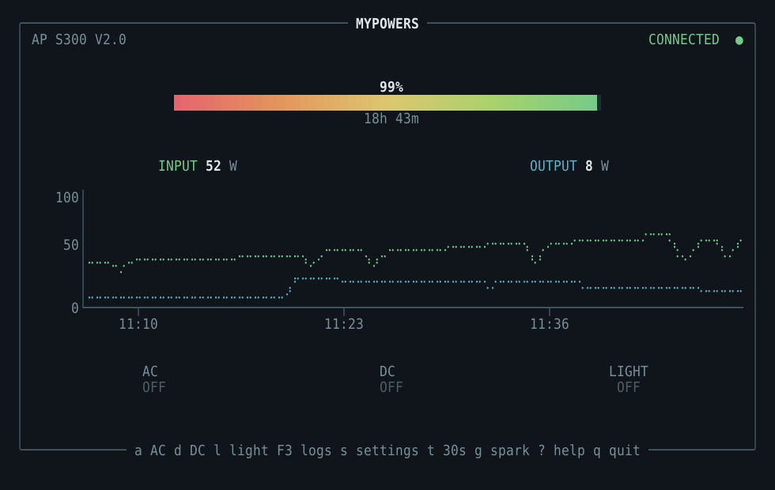

A Python daemon owns the Bluetooth connection and runs collection and alerts continuously.
The Rust/Ratatui TUI and native Rust CLI connect through an HTTP/WebSocket API, locally or remotely.
Closing the TUI leaves the daemon, recording and alerts running.

## Features

- Live battery percentage, remaining-time estimate and input/output power readings.
- Shared power charts or compact sparklines, with 10-second, 30-second, 1-minute and 1-hour buckets.
- AC, DC and LIGHT output controls with confirmation feedback.
- SQLite telemetry history, with gaps preserved when readings are unavailable.
- Telegram low-battery and recovery notifications with configurable hysteresis and cooldown.
- Saved chart preferences, timezone, log page size and alert settings.
- Live application logs, level filters and Bluetooth/daemon diagnostics.
- Keyboard and mouse controls, contextual help, local and remote clients.

Bluetooth support has been tested with an **AP S300 V2.0** unit and its qualified
control profile. Other models and firmware have not been validated. Controls cover
the AC group, DC group and common light; per-port control and SOS modes are outside
that profile. See the [hardware research](docs/research/s300/README.md) for details.

## Quick start

The server requires Linux, Python 3.12+, SQLite 3.37+, `uv`, BlueZ and system D-Bus.
The native CLI and TUI also require Rust/Cargo. The server's Bluetooth controller must be accessible
to its service account. Clients can run on a different machine without Bluetooth access.

From a checkout of this repository:

```bash
uv sync --locked --extra server
cp .env.example .env
```

Edit `config/development.yaml`: set `device.address` to your station's Bluetooth address
and `bluetooth.adapter_address` to your controller's address. The checked-in values
belong to the development setup. `bluetoothctl list` lists available controllers.
The `.env` file selects this YAML and the local data directories.

Validate the configuration and start the daemon:

```bash
uv run mypowersd check-config
uv run mypowersd
```

In another terminal, build and install both native clients into the project's environment:

```bash
cargo build --release --locked --manifest-path frontends/tui/Cargo.toml
install -m 755 frontends/tui/target/release/mypowers .venv/bin/mypowers
install -m 755 frontends/tui/target/release/mypowers-tui .venv/bin/mypowers-tui
uv run mypowers-tui
```

The Python `server` extra supplies Bluetooth and API dependencies. CLI and TUI are
native Rust executables built together, with a shared API client and dashboard renderer.
They need no Python installation on a client machine. To install both on your Cargo
path, run `cargo install --locked --path frontends/tui`.

Server, CLI and TUI read `.env` from their current working directory. Use
`--env-file PATH` to select another file. The example uses loopback port **8765**
and disables authentication for local development. For remote clients, configure
`MYPOWERS_SERVER_URL` and authentication as described in [configuration](docs/configuration.md).
For a supervised production installation, including Proxmox LXC prerequisites,
see [deployment](deploy/README.md).

## Using the TUI

| Key | Action |
| --- | --- |
| `a` / `d` / `l` | Toggle AC / DC / LIGHT on the dashboard |
| `Tab`, then `Enter` or `Space` | Select and activate an output |
| `g` | Switch Chart / Sparkline for the current session |
| `t` | Cycle graph bucket interval: 10s / 30s / 60s / 1h |
| `s` | Open Settings |
| `F3` | Open application logs |
| `?` or `F1` | Open contextual help |
| `Esc` | Close the current overlay |
| `q` | Open quit confirmation |
| `Ctrl+Q` | Quit immediately |

Settings contains **Preferences**, **Charts**, **Alerts**, **Notify** and **Debug**.
The Settings controls use Ratcn. Choose **Preferences → Theme (local)** to switch
between MyPowers, Catppuccin, Nord, Gruvbox, Tokyo Night, Solarized and Terminal.
Themes currently style Settings; the dashboard and charts retain their original design.
Local styles and navigation shortcuts live in `~/.config/mypowers/client.toml`;
see the [example client configuration](config/client.example.toml).

Save changes to persist chart/log preferences and the battery rule on the server. Notify sends
a test message; Debug shows connection details and offers retry, pause/resume and
runtime debug logging. Output controls require current telemetry and daemon permission.

See the [TUI guide](frontends/tui/README.md) for log navigation, mouse controls and options.

## Telegram battery alerts

Set both credentials in the **server's** `.env`:

```dotenv
MYPOWERS_TELEGRAM_BOT_TOKEN=your-bot-token
MYPOWERS_TELEGRAM_CHAT_ID=your-chat-id
```

Restart the daemon after changing credentials. Open **Settings → Notify → Send test message**
to verify delivery. Credentials stay on the server and are excluded from public settings.

The default rule is:

```yaml
battery_alert:
  enabled: true
  threshold_percent: 20
  hysteresis_percent: 5
  min_notification_interval_minutes: 10
```

At **20% or below**, the rule enters ALERT. At **25% or above**, it returns to NORMAL
and sends RECOVERED. During the 10-minute cooldown, only the latest state is retained;
intermediate oscillations are not replayed. If an ALERT was sent and the battery briefly
recovers before becoming low again during cooldown, no duplicate ALERT is sent.
There are no periodic low-battery reminders or escalation messages.

Alerts use fresh LIVE telemetry and run entirely in the daemon. State and notification
timestamps survive restarts, and transitions and delivery outcomes are logged.
Edit the rule in **Settings → Alerts**; saved settings override initial YAML defaults.
See [alert configuration and delivery behavior](docs/configuration.md) for details.

## Command-line client

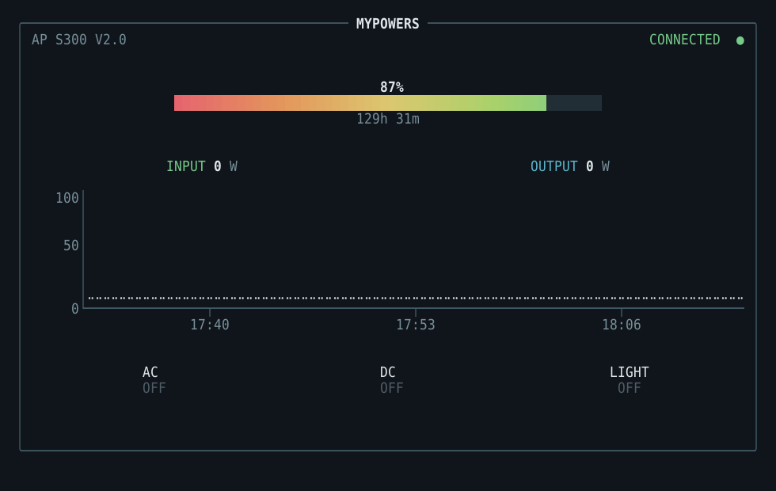

`mypowers status` prints a one-shot dashboard with battery, power history and actual
AC/DC/LIGHT states, then exits. It shares the TUI renderer but has no keyboard hints,
interactive controls or selection highlight. `ON` is green and `OFF` is dimmed.
The snapshot stays in terminal scrollback; it never enters the alternate screen.
`--json` prints the original API response without graphics, colors or extra requests.

```bash
uv run mypowers status
uv run mypowers status --json
uv run mypowers logs --tail 10
uv run mypowers logs --follow
uv run mypowers tui
```

Commands that change station outputs:

```bash
uv run mypowers ac on
uv run mypowers dc off
uv run mypowers light on
```

Connection management and temporary debug logging:

```bash
uv run mypowers connection pause
uv run mypowers connection resume
uv run mypowers debug on --duration 15m
uv run mypowers debug off
```

## Screenshot gallery

These images use **real daemon telemetry, database history, settings and application logs**,
captured on **6 October 2026** through the production Ratatui renderer.
All images have the same **980 × 620** canvas. Click an image to open it at full size.

| Preferences | Charts |
| --- | --- |
| [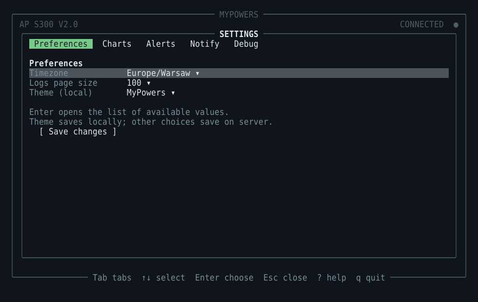](docs/screenshots/settings-modal.svg) | [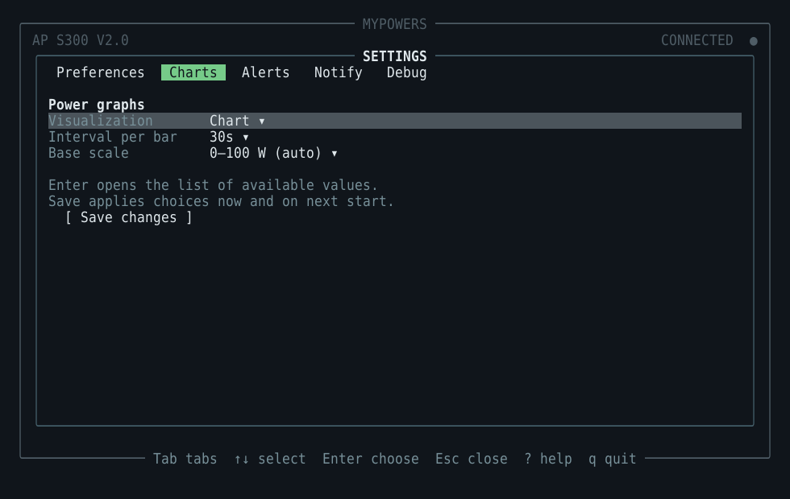](docs/screenshots/settings-charts.svg) |

| Battery alerts | Telegram notifications |
| --- | --- |
| [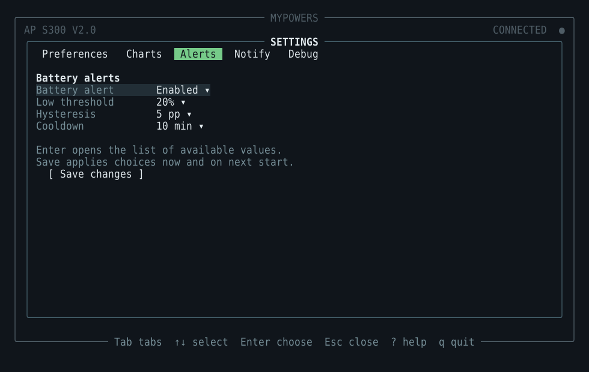](docs/screenshots/settings-alerts.svg) | [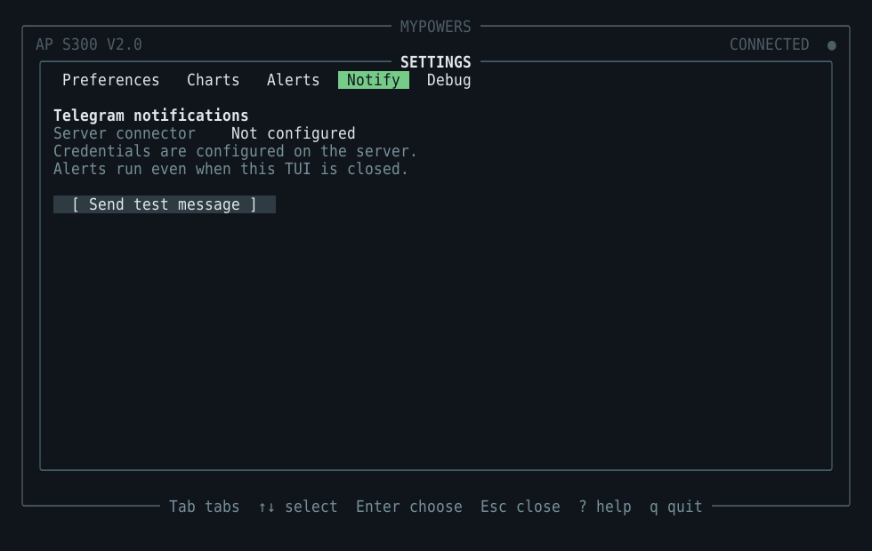](docs/screenshots/settings-notify.svg) |

| Diagnostics | Application logs |
| --- | --- |
| [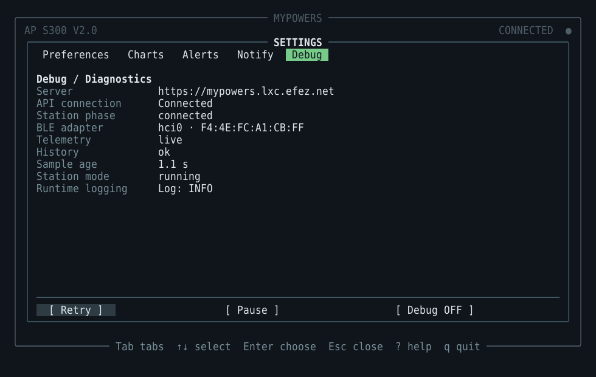](docs/screenshots/settings-debug.svg) | [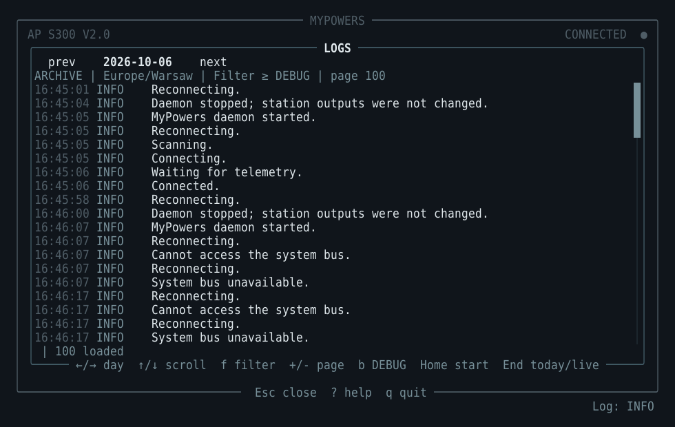](docs/screenshots/logs-modal.svg) |

<details>
<summary>More views: chart intervals, Sparkline, help and value selection</summary>

| One-minute chart | One-hour chart |
| --- | --- |
| [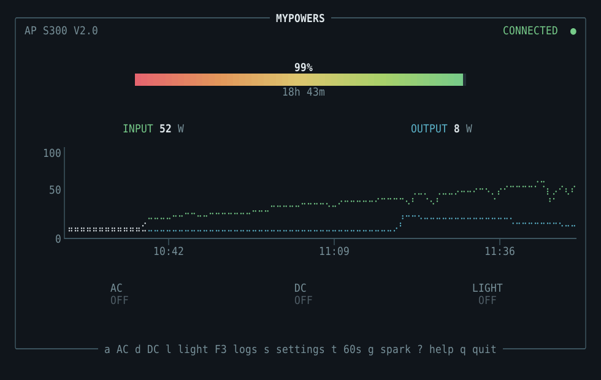](docs/screenshots/dashboard-chart-60s.svg) | [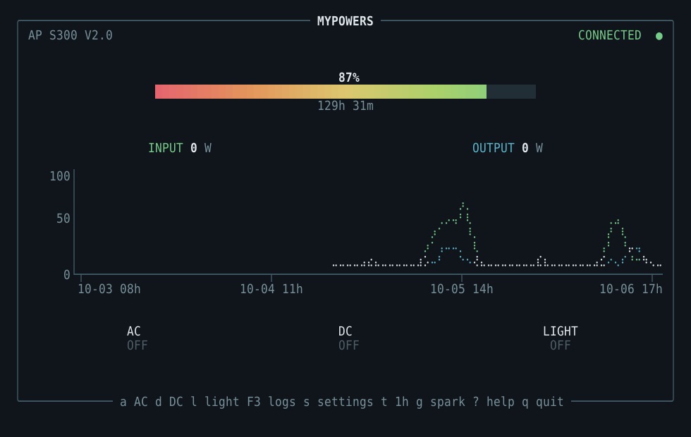](docs/screenshots/dashboard-chart-1h.svg) |

| Sparkline | Contextual help |
| --- | --- |
| [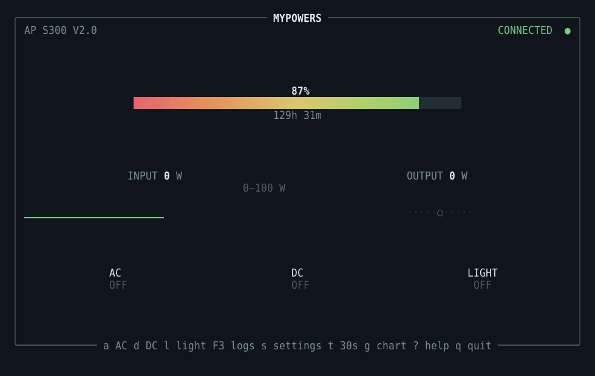](docs/screenshots/dashboard-live-30s.svg) | [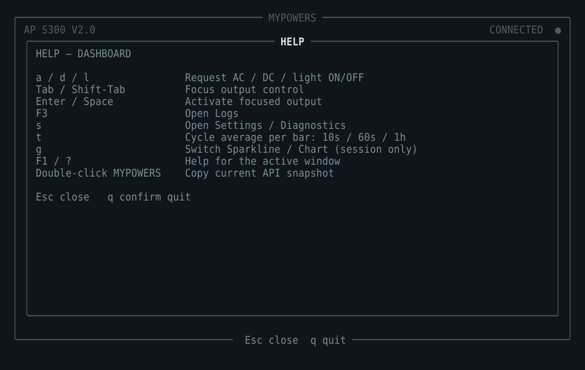](docs/screenshots/help-modal.svg) |

[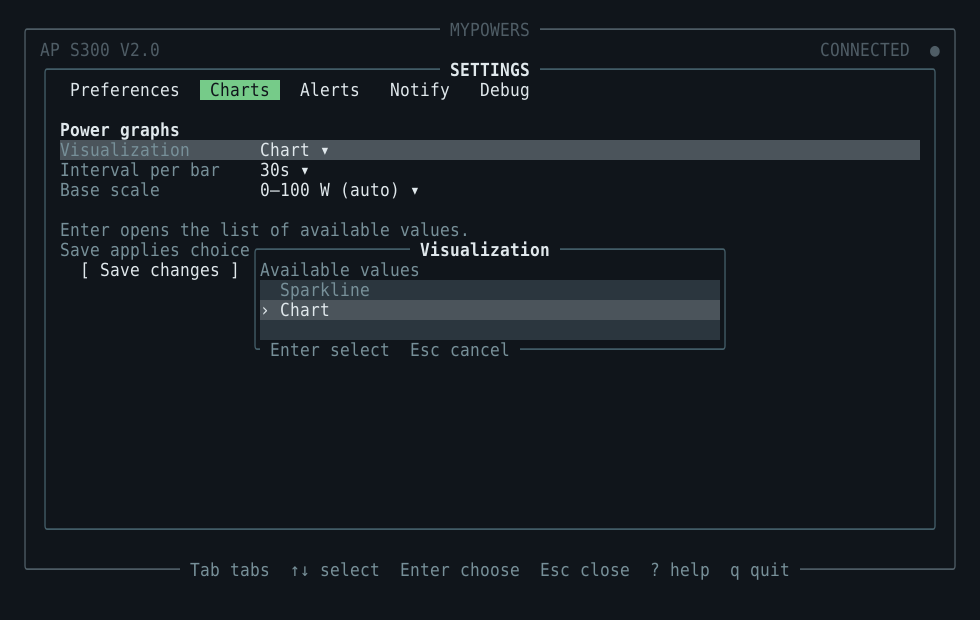](docs/screenshots/settings-visualization-picker.svg)

</details>

<details>
<summary>Settings themes</summary>

| Catppuccin | Nord |
| --- | --- |
| [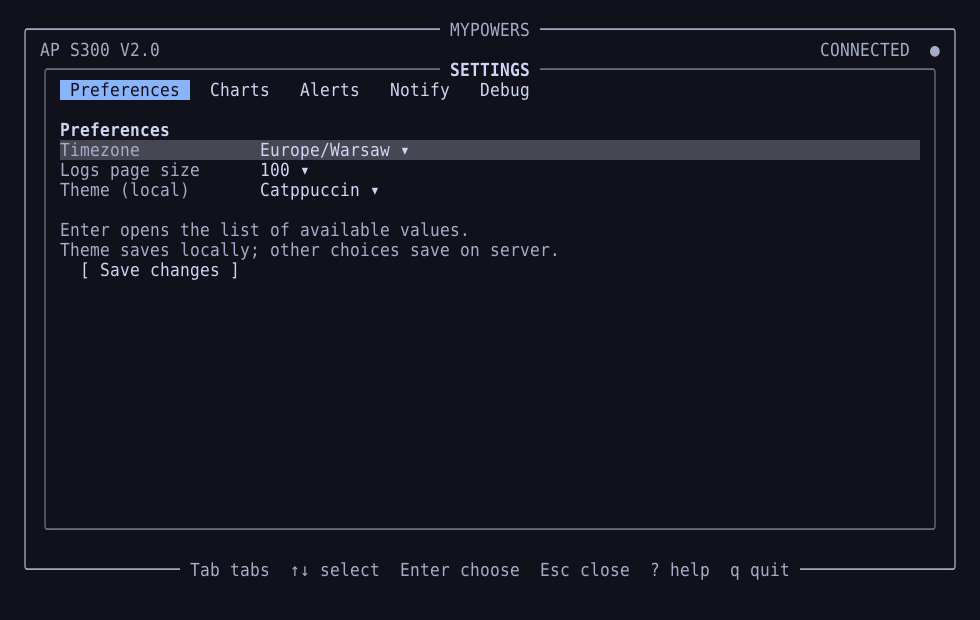](docs/screenshots/settings-theme-catppuccin.svg) | [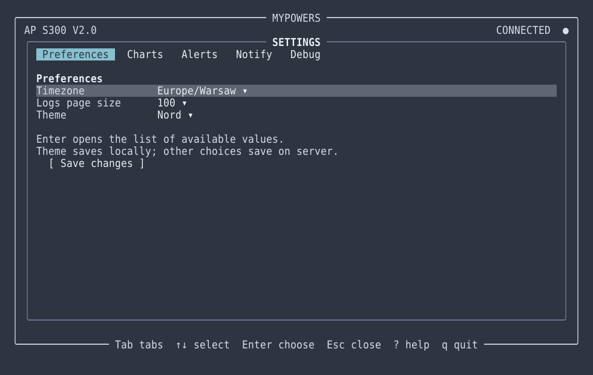](docs/screenshots/settings-theme-nord.svg) |

| Gruvbox | Tokyo Night |
| --- | --- |
| [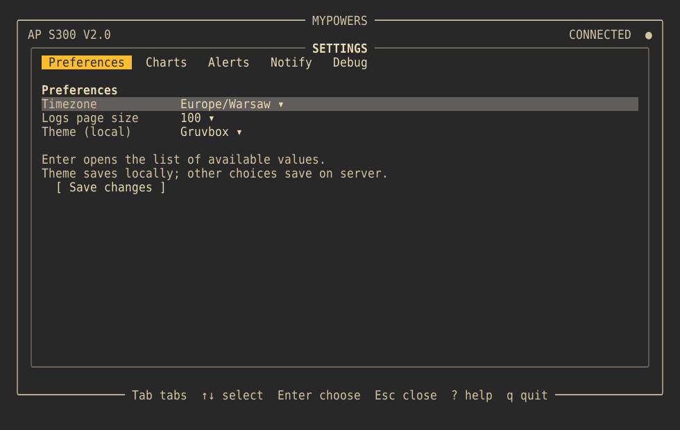](docs/screenshots/settings-theme-gruvbox.svg) | [](docs/screenshots/settings-theme-tokyo-night.svg) |

| Solarized | Terminal |
| --- | --- |
| [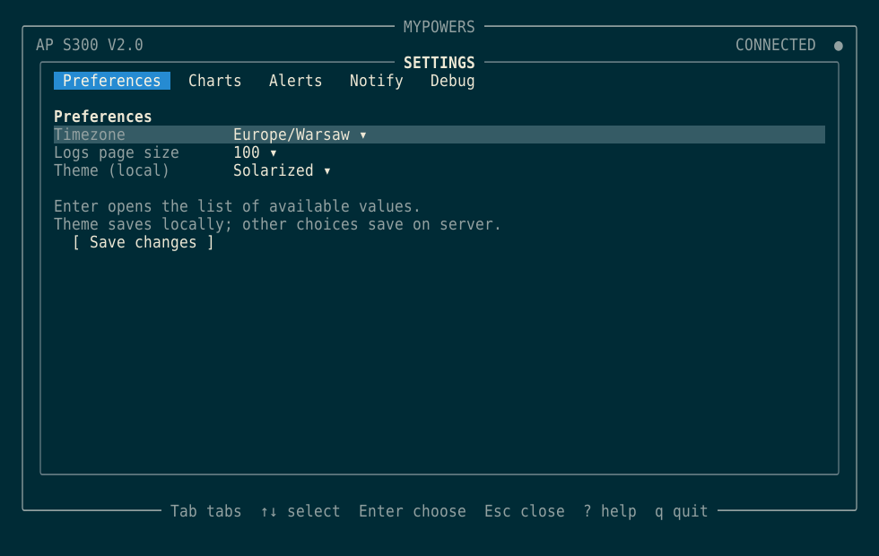](docs/screenshots/settings-theme-solarized.svg) | [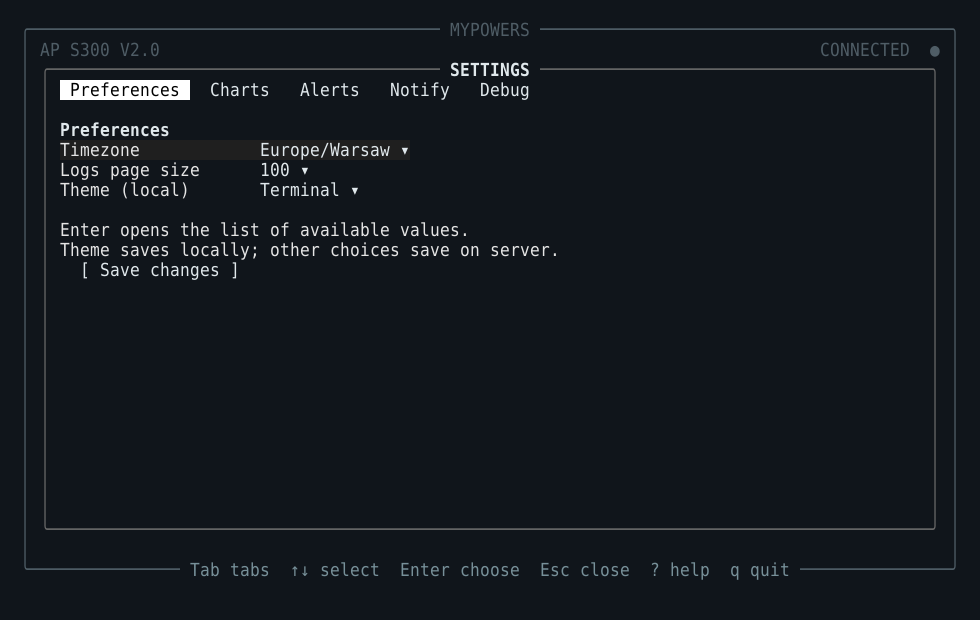](docs/screenshots/settings-theme-terminal.svg) |

</details>


## Development and verification

```bash
uv sync --locked --extra server --group dev
uv run ruff check src frontends tests
uv run ruff format --check src frontends tests
uv run mypy src
uv run pytest -m 'not hardware'
cargo test --locked --manifest-path frontends/tui/Cargo.toml
cargo test --locked --manifest-path xtask/Cargo.toml
cargo xtask ui-snapshots --check
```

For an isolated development daemon without hardware, explicitly select
`uv run mypowersd --backend simulated`. Simulation is never selected automatically
when Bluetooth fails and is disallowed in production.

`cargo xtask ui-snapshots` generates deterministic regression images using fixed test data.
The README gallery uses a separate read-only live capture. See the
[screenshot workflow](artifacts/ui/README.md) for both modes and gallery updates.
Real hardware checks have a separate [hardware test guide](tests/hardware/README.md).

## Documentation

- [Configuration and persisted preferences](docs/configuration.md)
- [Deployment and service supervisors](deploy/README.md)
- [Operations](docs/operations.md)
- [TUI guide](frontends/tui/README.md)
- [HTTP API and WebSocket streams](docs/api.md) · [OpenAPI](docs/openapi.json)
- [History storage and migration](docs/history-migration.md)
- [Validation results](docs/validation/IMPLEMENTATION_VALIDATION.md)
- [Hardware research](docs/research/s300/README.md)
- [Product requirements](docs/PRD.md)

## License

[CC0 1.0 Universal](LICENSE).
