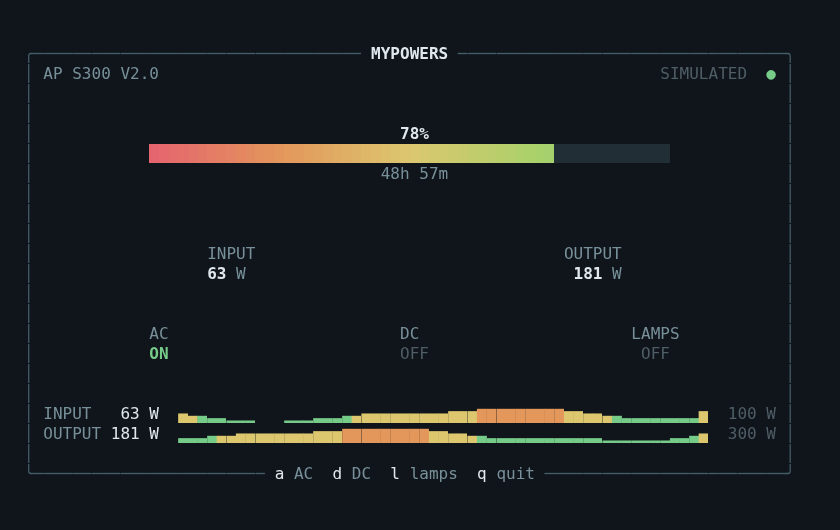

# MyPowers Ratatui visual prototype

A standalone Rust interaction and rendering experiment using **fake data only**.
It has no BLE, HTTP, WebSocket, SQLite, configuration-file, or daemon integration.
This is a visual prototype, not a production client.

From the repository root:

```sh
cd prototypes/ratatui-ui
cargo run
```

Use a terminal with Unicode and true-color support. Crossterm respects `NO_COLOR`;
if your environment sets it, use `env -u NO_COLOR cargo run` to evaluate colors.

## Interaction

| Input | Effect |
| --- | --- |
| `q`, `Esc`, `Ctrl-C` | Quit |
| `a` | Toggle mock AC |
| `d` | Toggle mock DC |
| `l` | Toggle mock lamps |
| Left click on an output label/state | Toggle that mock output |
| Mouse movement over an output | Highlight its region |

The most recently toggled output retains a subtle selection background.
All toggles affect local fake state only. Both input and output readings remain
visible regardless of those states.

Connection status is a static, bold green circle (`●`); offline status uses a
static red circle. Rendering updates at 8 FPS. Independent fake power readings and their
128-sample histories update once per second. Battery stays at 78%, remaining time
at 48h 57m. Initial readings are 63 W input and 181 W output; AC starts on, DC and
lamps off.

Minimum terminal size is **60 columns × 18 rows**. Smaller terminals show a
centered size message and have no clickable output regions. At larger sizes the
single composition is centered and limited to 94 columns × 22 rows.

## Rendering

The screen is composed with actual Ratatui primitives, not a preformatted ASCII
screen or raw ANSI rendering:

- `Terminal<CrosstermBackend>` and `Frame` manage buffered drawing and updates.
- `Layout`, `Constraint`, `Flex`, and `Rect` position each region during resize.
- One `Block` uses `Borders::ALL` and `BorderType::Rounded`, with centered top and
  bottom border titles. Controls have no individual boxes.
- `Paragraph`, `Line`, and `Span` render the station name, live circle, percentage,
  time, independent power readings, states, scale labels, and key hints.
- Two built-in `Sparkline` widgets use explicit `.max(100)` and `.max(300)`.
  The newest sample stays at the right edge. `SparklineBar::style` colors each
  sample green, yellow, or orange using its fraction of that fixed range. Red is
  reserved for the low-battery end of the gradient and the offline indicator.

**Only the battery needs a custom `Widget`.** It writes styled cells into
Ratatui's `Buffer`, interpolating RGB stops from red through orange, yellow and
lime to green. Colored cell backgrounds avoid seams caused by full-block glyph
antialiasing. A half-block handles a fractional final cell. The remainder uses
a dark track. The gradient follows the full 0–100% scale, so a 78% charge ends
near lime/green rather than prematurely reaching the 100% color.

Ratatui 0.30 supports per-bar Sparkline styles directly, so a custom graph is
unnecessary. Compare with a uniformly colored standard Sparkline rendering:

```sh
cargo run -- --uniform-sparklines
```

The uniform version colors each entire graph according to its current reading;
both versions retain the same fixed scales. Preview the static red offline
indicator with frozen telemetry:

```sh
cargo run -- --offline
```



This preview exports the actual Ratatui `TestBackend` buffer at 80×24, including
its cell colors and styles. A browser was used only to save the image; the
running terminal application uses Rust, Ratatui, and Crossterm exclusively.

## Build and verification

```sh
cargo fmt --check
cargo clippy --all-targets -- -D warnings
cargo test
cargo build --release
ls -lh target/release/mypowers-ratatui
```

The release profile uses size optimization, thin LTO, and stripped symbols.
The measured x86_64 Linux release binary is approximately **646 KiB** (661,096
bytes), dynamically linked. Its exact size varies with compiler and platform.
Only Ratatui and Crossterm are direct dependencies; `Cargo.lock` fixes the
resolved dependency graph.

Verification includes seven state/rendering tests and four real Linux PTY
scenarios (plus a subprocess cleanup fixture). PTY tests require util-linux
`script` and `stty`; they run the actual binary, inject keyboard and SGR mouse
events, resize down and back up, check real RGB output, and compare terminal
settings before and after exit. Separate probes verify restoration after an
I/O error and a panic. These helpers are test tools, not runtime dependencies.
The prototype was also launched interactively with `cargo run`.

Raw mode, alternate screen, mouse capture, and hidden cursor are managed by a
drop guard. The panic hook restores terminal state before printing the panic.
Each cleanup operation is attempted independently.

To export rendering buffers for visual inspection without adding dependencies:

```sh
MYPOWERS_PREVIEW_DIR=target/preview cargo test layouts_keep_controls
```

## Visual limits

- Terminal cells fix text size. Percentage prominence comes from placement and
  bold weight; this prototype does not emulate a scalable display font.
- A one-row Sparkline has nine discrete height levels, including zero. Tiny
  samples can therefore disappear even though the fixed scale is correct.
- The battery gradient is continuous in RGB interpolation but still quantized
  to cells; fill precision is half a cell. Terminals without true color reduce
  the smoothness.
- Border curvature, circle sizes, and block heights depend on the terminal font.
- Mouse motion requires support from the terminal; keyboard controls always
  remain available. Verification here covers Linux, not other operating systems.
